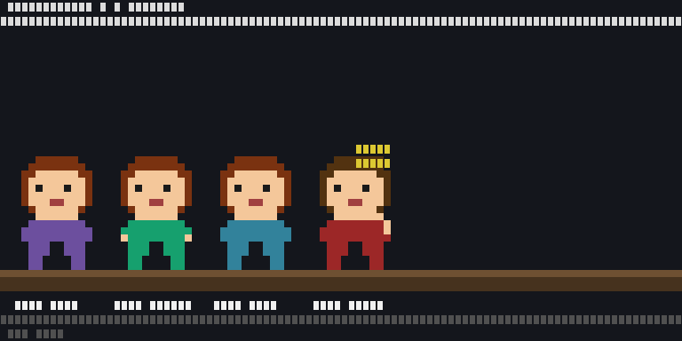

# ascii-agents

[](https://github.com/IvanWng97/ascii-agents/actions/workflows/ci.yml)
[](LICENSE)
[](https://www.rust-lang.org/)

A terminal-native, multi-agent pixel-art visualizer for AI coding agents. Each running [Claude Code](https://claude.com/claude-code) session appears as an animated character in a top-down coworking office — typing at desks, wandering to the pantry for coffee, lounging on the couch, or walking through the corridor. All rendered with half-block pixel art at 24-bit color, right in your terminal.



> Inspired by [`pablodelucca/pixel-agents`](https://github.com/pablodelucca/pixel-agents) (VS Code webview) and [`rullerzhou-afk/clawd-on-desk`](https://github.com/rullerzhou-afk/clawd-on-desk) (desktop pet). Different niche: pure terminal, no Electron, no browser, runs over SSH.

## Features

- **Multi-agent coworking office** — each CC session gets a desk; overflow agents work from meeting-room sofas and floor seats with laptops
- **Animated characters** — typing, waiting, idle, walking between waypoints with A*-routed pathfinding
- **Coworking-lounge layout** — city-view windows, meeting room with sofas, pantry with coffee machine, cubicle pods with aisle decor, elevator door animation
- **Per-agent identity** — deterministic shirt/hair/skin palette from session hash, Wes Anderson + Studio Ghibli outfit presets
- **Per-tool monitor glow** — Edit = blue, Bash = orange, Read = cyan, Agent/Task = purple (scannable at a glance)
- **Status-bar footer** — agent count + state breakdown + active tool tally, adapts to terminal width
- **Hover tooltips** — mouse over a character to see agent details (cwd, tool, session ID)
- **Wander state machine** — idle agents leave desks, walk to the couch / pantry / standing desk / phone booth, return via snap-back animation
- **Dual event sources** — hook socket (real-time) + JSONL transcript watching (fallback), transport-tagged dedup
- **Hook-safe** — the shim always exits 0 with a 200ms timeout; a stuck visualizer can never block Claude Code
- **147+ tests** — TDD-shaped, including walkable-mask BFS connectivity across 5 terminal sizes

## Install

### Homebrew (macOS / Linux)

```bash
brew install IvanWng97/ascii-agents/ascii-agents
```

### Pre-built binaries

Download from [GitHub Releases](https://github.com/IvanWng97/ascii-agents/releases/latest):

| Platform | Tarball |
|---|---|
| macOS (Apple Silicon) | `ascii-agents-v*-aarch64-apple-darwin.tar.gz` |
| macOS (Intel) | `ascii-agents-v*-x86_64-apple-darwin.tar.gz` |
| Linux (x86_64, glibc) | `ascii-agents-v*-x86_64-unknown-linux-gnu.tar.gz` |
| Linux (ARM64) | `ascii-agents-v*-aarch64-unknown-linux-gnu.tar.gz` |

### From source

Requires Rust 1.78+ (`brew install rust` on macOS).

```bash
git clone https://github.com/IvanWng97/ascii-agents
cd ascii-agents
cargo build --release
```

Two binaries in `target/release/`: `ascii-agents` (TUI) and `ascii-agents-hook` (shim).

## Quick start

```bash
# Wire Claude Code's hooks (one-time, survives TUI restarts).
ascii-agents install-hooks

# Start the office.
ascii-agents
```

In another terminal, start a Claude Code session (`claude`). A character walks in from the elevator within a second.

**`q` / Esc / Ctrl-C** quits the TUI. Hooks stay installed — the shim silently no-ops when the TUI isn't running.

### Headless / scripting

```bash
ascii-agents run --headless --projects-root ~/.claude/projects --max-desks 16
```

Prints a one-line summary every time the scene changes. Useful for CI and observability.

## How it works

```
CC tool call ──► CC fires hook ──► ascii-agents-hook (shim)
                                         │ JSON over Unix socket
                                         ▼
                                  $XDG_RUNTIME_DIR/ascii-agents.sock
                                         │
                       HookSocketListener ─────► ┐
                                                 │ (Transport, AgentEvent)
                       JsonlWatcher       ─────► ┤ shared mpsc channel
                                                 ▼
                       Reducer ──► SceneState (watch channel)
                                         │
                       TuiRenderer ──► draw_scene @ ~30fps
                       (pose → pixel_painter → RgbBuffer → half-block → ratatui)
```

Three Rust crates:

| Crate | Role |
|---|---|
| **ascii-agents-core** | Headless library — no terminal deps. Owns `Source` trait, `Renderer` trait, reducer, pose derivation, layout geometry, sprite engine. |
| **ascii-agents** | TUI binary — ratatui + crossterm + tokio. `TuiRenderer` wires the `Renderer` trait to half-block rendering. |
| **ascii-agents-hook** | Tiny shim CC invokes from hooks. Forwards JSON to the socket with 200ms timeout. Always exits 0. |

## Extending (multi-CLI)

`Source` is the only abstraction for adding a new agent CLI:

```rust
#[async_trait]
pub trait Source: Send + 'static {
    fn name(&self) -> &str;
    async fn run(self: Box<Self>, tx: TaggedSender) -> anyhow::Result<()>;
}
```

A future `CodexSource` / `CursorSource` / `GeminiSource` implements the trait, writes tagged events onto the channel, and `SourceManager::with_source()` plugs it in.

## Verify visually

```bash
cargo run --release --example snapshot -- /tmp/snap.png
open /tmp/snap.png
```

For quadrant crops during sprite iteration:

```bash
python3 -m venv .venv && .venv/bin/pip install -r requirements-dev.txt
.venv/bin/python3 scripts/crop-snapshot.py /tmp/snap.png --scale 3
```

## Acknowledgments

- [`pablodelucca/pixel-agents`](https://github.com/pablodelucca/pixel-agents) — the inspiration. Same concept, VS Code webview.
- [`rullerzhou-afk/clawd-on-desk`](https://github.com/rullerzhou-afk/clawd-on-desk) — multi-agent hook-based pattern, desktop-pet form factor.
- Claude Code's built-in [Buddy](https://dev.to/picklepixel/how-i-reverse-engineered-claude-codes-hidden-pet-system-8l7) ASCII pet — proves a single-character terminal pet is delightful; this extends it to multi-agent + zoomed-out scene.

## License

[MIT](LICENSE)
