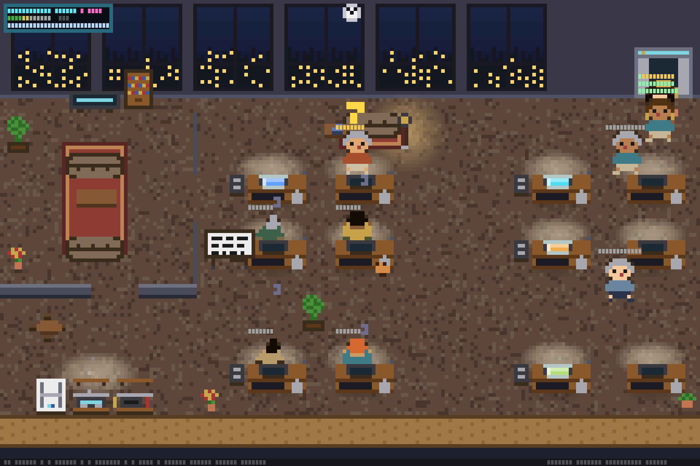
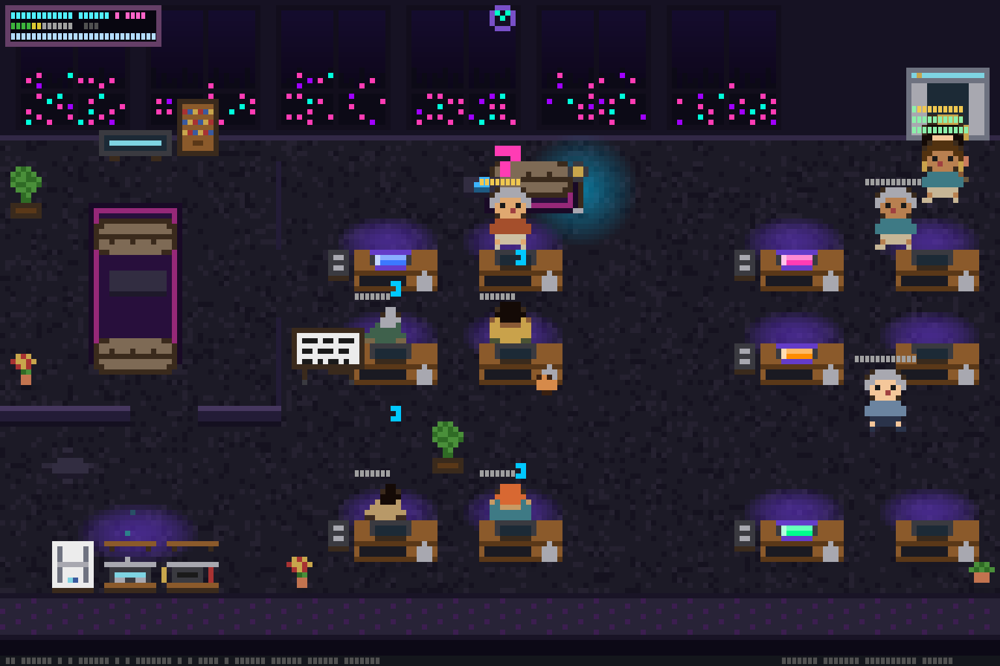
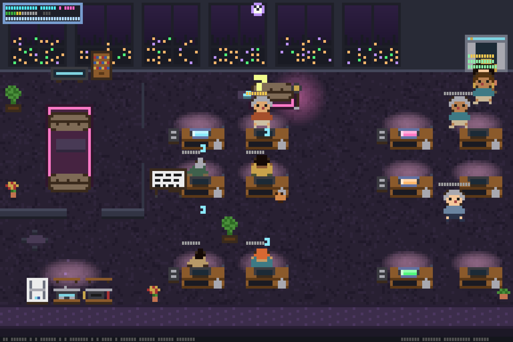
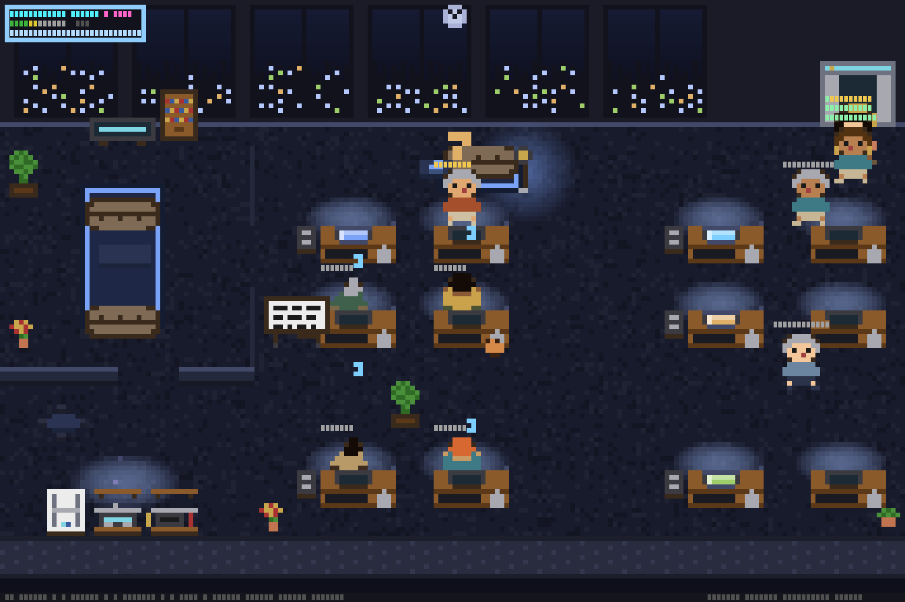
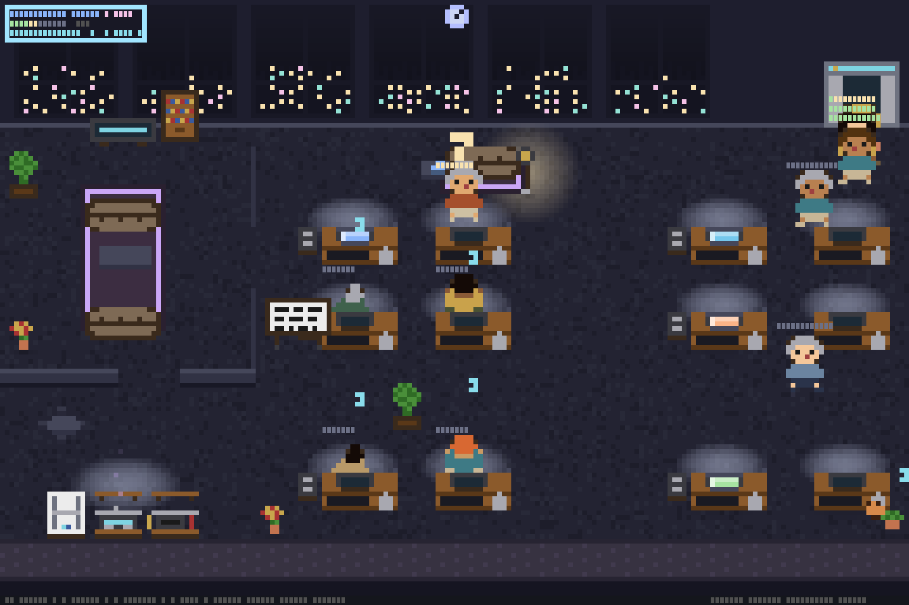
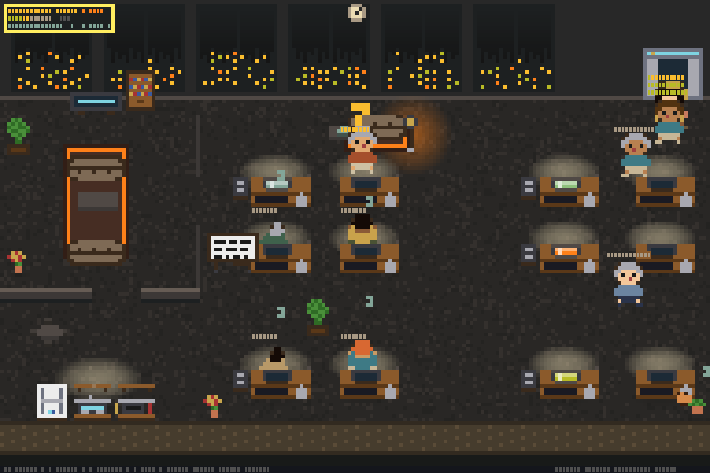
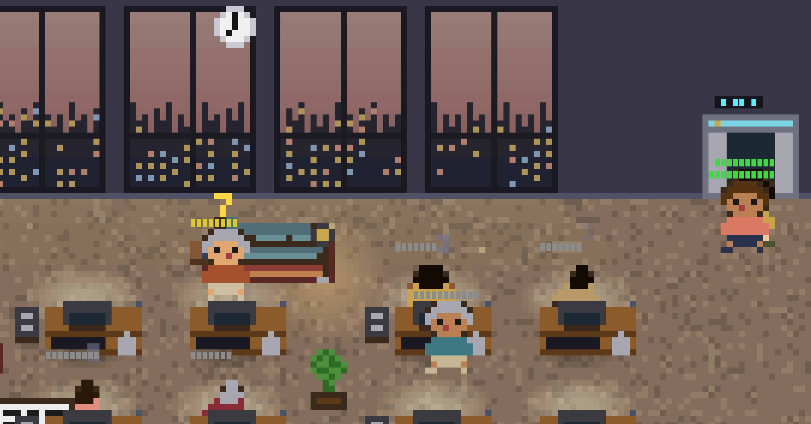
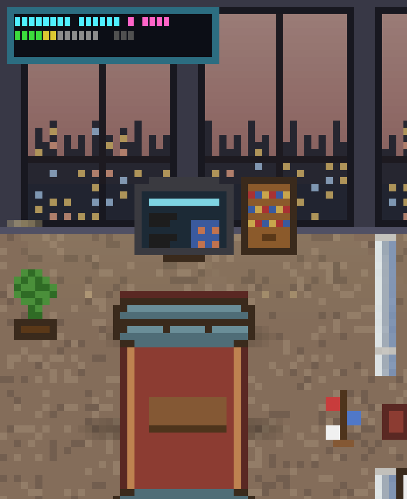
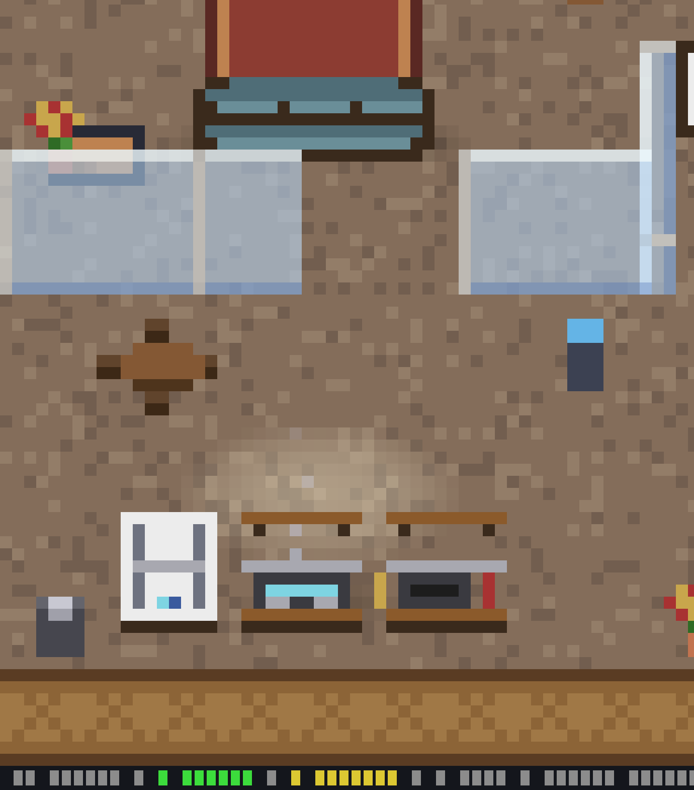

<p align="center">
  
</p>

<h1 align="center">ascii-agents</h1>

<p align="center">
  <strong>Your AI coding agents deserve an office.</strong><br />
  A terminal-native pixel-art coworking lounge where every Claude Code session is a character —<br />
  typing at desks, wandering to the pantry, napping on the couch.
</p>

<p align="center">
  <a href="https://github.com/IvanWng97/ascii-agents/actions/workflows/ci.yml"></a>
  <a href="https://codecov.io/gh/IvanWng97/ascii-agents"></a>
  <a href="https://crates.io/crates/ascii-agents"></a>
  <a href="LICENSE"></a>
  <a href="https://www.rust-lang.org/"></a>
  <a href="https://github.com/IvanWng97/ascii-agents/releases"></a>
</p>

---

> Inspired by [`pixel-agents`](https://github.com/pablodelucca/pixel-agents) (VS Code webview) and [`clawd-on-desk`](https://github.com/rullerzhou-afk/clawd-on-desk) (desktop pet). Different niche: **pure terminal**, no Electron, no browser — runs over SSH.

## Why?

You're running 5 Claude Code sessions across 3 repos. Which one is typing? Which one is stuck waiting for permission? Which one finished 10 minutes ago and you forgot about?

**ascii-agents** gives you a single pane of glass: a pixel-art office where each session is a character. Typing agents sit at desks with glowing monitors. Waiting agents stand up with a `?` bubble. Idle agents doze off — head on desk, z's floating. You see everything at a glance.

## Themes

Press `t` in the TUI to open the theme picker with live preview. 6 built-in themes:

<table>
  <tr>
    <td align="center"><strong>Normal</strong><br /></td>
    <td align="center"><strong>Cyberpunk</strong><br /></td>
  </tr>
  <tr>
    <td align="center"><strong>Dracula</strong><br /></td>
    <td align="center"><strong>Tokyo Night</strong><br /></td>
  </tr>
  <tr>
    <td align="center"><strong>Catppuccin Mocha</strong><br /></td>
    <td align="center"><strong>Gruvbox Dark</strong><br /></td>
  </tr>
</table>

## Gallery

<table>
  <tr>
    <td align="center"><strong>Cubicle pods</strong><br />Agents typing at desks with per-tool monitor glow<br /></td>
    <td align="center"><strong>Meeting room</strong><br />Overflow agents on sofas with laptops<br /></td>
  </tr>
  <tr>
    <td align="center"><strong>Pantry</strong><br />Kitchen counter, bistro table, potted plants<br /></td>
    <td align="center"><strong>Status footer</strong><br /><code>12 agents · 4 active · 2 waiting · 6 idle · Bash×1 Write×1</code></td>
  </tr>
</table>

## Features

- 🏢 **Multi-agent coworking office** — each CC session gets a desk; overflow agents work from meeting-room sofas and floor seats with laptops
- 🎭 **Animated characters** — typing, waiting (standing + `?` bubble), sleeping (head-on-desk + z's, slumped variants), walking between waypoints
- 🧭 **A\*-routed pathfinding** — idle agents wander to the couch, pantry, standing desk, phone booth; route around furniture via cached A\* with selective invalidation
- 🎨 **Per-agent identity** — deterministic shirt/hair/skin palette from session hash, 16 curated outfits
- 💡 **Per-tool monitor glow** — Edit = blue, Bash = orange, Read = cyan, Agent/Task = purple (scannable at a glance)
- 🪟 **Coworking-lounge layout** — city-view windows, meeting room with sofas, pantry with coffee machine, cubicle pods with aisle decor, elevator door animation
- 📊 **Status-bar footer** — agent count + state breakdown + active tool tally, adapts to terminal width
- 🧹 **Stale agent cleanup** — state-adaptive timeouts (Active 10m, Idle 30m, Waiting 60m) auto-remove ghost sessions
- 🖱️ **Hover tooltips + click-to-pin** — mouse over or click a character to see agent details (cwd, active tool, session ID)
- 📺 **Neon wall display** — branding panel with pulsing cyan border, state dots, scrolling tool activity ticker, click ★ to star on GitHub
- 🐱 **Office cat** — roams desks, pantry, sofas, lounge; sleeps near idle agents with z's; 3 sprites (walk/sit/sleep)
- ☕ **Desk personalization** — coffee cup (10min), plant (30min), photo frame (1hr) appear on desks based on session age
- 📡 **Dual event sources** — hook socket (real-time) + JSONL transcript watching (fallback), transport-tagged dedup
- 🛡️ **Hook-safe** — the shim always exits 0 with a 200ms timeout; a stuck visualizer can never block Claude Code
- 🧱 **Half-block pixel art** — 24-bit RGB via `▀` cells, hand-drawn `.sprite` files, per-agent recolor by RGB substitution
- 🪵 **Crash logging** — panic hook restores terminal and writes backtrace to `~/.cache/ascii-agents/crash.log`

## Quick start

```bash
# Install (macOS / Linux)
brew install IvanWng97/ascii-agents/ascii-agents

# Wire Claude Code's hooks (one-time).
ascii-agents install-hooks

# Start the office.
ascii-agents
```

In another terminal, start a Claude Code session (`claude`). A character walks in from the elevator within a second.

## Keyboard shortcuts

| Key | Action |
|---|---|
| `q` / `Esc` / `Ctrl-C` | Quit |
| `p` | Pause / resume animation |
| `+` / `-` | Increase / decrease max desks |
| Click | Pin / unpin agent tooltip |

Hooks stay installed after quitting — the shim silently no-ops when the TUI isn't running.

## Install

### Homebrew (macOS / Linux)

```bash
brew install IvanWng97/ascii-agents/ascii-agents
```

### Pre-built binaries

Download from [GitHub Releases](https://github.com/IvanWng97/ascii-agents/releases/latest):

| Platform | Tarball |
|---|---|
| macOS (Apple Silicon) | `ascii-agents-v*-aarch64-apple-darwin.tar.gz` |
| macOS (Intel) | `ascii-agents-v*-x86_64-apple-darwin.tar.gz` |
| Linux (x86_64, static) | `ascii-agents-v*-x86_64-unknown-linux-musl.tar.gz` |
| Linux (ARM64) | `ascii-agents-v*-aarch64-unknown-linux-gnu.tar.gz` |

### Cargo (crates.io)

```bash
cargo install ascii-agents
```

### From source

Requires Rust 1.78+ (`brew install rust` on macOS).

```bash
git clone https://github.com/IvanWng97/ascii-agents
cd ascii-agents
cargo build --release
```

Two binaries in `target/release/`: **`ascii-agents`** (TUI) and **`ascii-agents-hook`** (shim).

## How it works

```
CC tool call ──► CC fires hook ──► ascii-agents-hook (shim)
                                         │ JSON over Unix socket
                                         ▼
                                  /tmp/ascii-agents.sock
                                         │
                       HookSocketListener ─────► ┐
                                                 │ (Transport, AgentEvent)
                       JsonlWatcher       ─────► ┤ shared mpsc channel
                                                 ▼
                       Reducer ──► SceneState (watch channel)
                                         │
                       TuiRenderer ──► draw_scene @ ~30fps
                       (pose → pixel_painter → RgbBuffer → half-block → ratatui)
```

Three Rust crates:

| Crate | Role |
|---|---|
| **ascii-agents-core** | Headless library — no terminal deps. Owns `Source` trait, `Renderer` trait, reducer, pose derivation, layout geometry, sprite engine. |
| **ascii-agents** | TUI binary — ratatui + crossterm + tokio. `TuiRenderer` wires the `Renderer` trait to half-block rendering. |
| **ascii-agents-hook** | Tiny shim CC invokes from hooks. Forwards JSON to the socket with 200ms timeout. Always exits 0. |

## Extending (multi-CLI)

`Source` is the only abstraction for adding a new agent CLI:

```rust
#[async_trait]
pub trait Source: Send + 'static {
    fn name(&self) -> &str;
    async fn run(self: Box<Self>, tx: TaggedSender) -> anyhow::Result<()>;
}
```

A future `CodexSource` / `CursorSource` / `GeminiSource` implements the trait, writes tagged events onto the channel, and `SourceManager::with_source()` plugs it in.

## Contributing

See [`CLAUDE.md`](CLAUDE.md) for architecture, conventions, and the sprite iteration workflow. PRs welcome — especially new `Source` adapters for other agent CLIs.

## Acknowledgments

- [`pablodelucca/pixel-agents`](https://github.com/pablodelucca/pixel-agents) — the inspiration. Same concept, VS Code webview.
- [`rullerzhou-afk/clawd-on-desk`](https://github.com/rullerzhou-afk/clawd-on-desk) — multi-agent hook-based pattern, desktop-pet form factor.
- Claude Code's built-in [Buddy](https://dev.to/picklepixel/how-i-reverse-engineered-claude-codes-hidden-pet-system-8l7) ASCII pet — proves a single-character terminal pet is delightful; this extends it to multi-agent + zoomed-out scene.

## License

[MIT](LICENSE)
