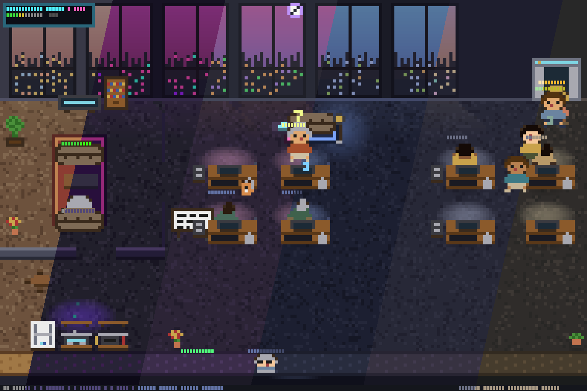

<p align="center">
  
</p>

<h1 align="center">ascii-agents</h1>

<p align="center">
  <em>Your AI coding agents, visualized as pixel-art coworkers in a terminal office.</em>
</p>

<p align="center">
  
</p>

<p align="center">
  <a href="https://github.com/IvanWng97/ascii-agents/stargazers"></a>
  <a href="https://github.com/IvanWng97/ascii-agents/releases"></a>
  <a href="LICENSE"></a>
  <a href="https://github.com/IvanWng97/ascii-agents/actions/workflows/ci.yml"></a>
  <a href="https://codecov.io/gh/IvanWng97/ascii-agents"></a>
  <a href="https://claude.ai/code"></a>
</p>

<p align="center">
  <a href="#quick-start">Quick Start</a> · <a href="#features">Features</a> · <a href="#themes">Themes</a> · <a href="#install">Install</a> · <a href="#how-it-works">How It Works</a>
</p>

---

## Why?

Running multiple AI agents in the terminal is like managing a sweatshop you can't see. They type, they wait, they finish — and you have no idea who's doing what unless you scroll through logs like a bureaucrat.

**ascii-agents** gives you the view from above. Your agents become tiny pixel-art workers trapped in an office — typing at desks that glow with the color of their current tool, standing up with `?` bubbles when they need your permission, dozing off at their desks when you forget about them. A cat roams between cubicles, completely indifferent to the work being done.

It's a little bit *Black Mirror*, a little bit *The Sims*, and somehow the most intuitive multi-agent dashboard you'll ever use.

## Features

| | Feature | Description |
|---|---|---|
| 🏢 | **Multi-agent office** | Each CC session gets a desk; overflow agents work from sofas and floor seats |
| 🎭 | **Animated characters** | Typing, waiting (`?` bubble), sleeping (z's), walking with A\*-routed pathfinding |
| 💡 | **Per-tool monitor glow** | Edit = blue, Bash = orange, Read = cyan — scannable at a glance |
| 🎨 | **Per-agent identity** | Deterministic shirt/hair/skin palette from session hash, 16 curated outfits |
| 🐱 | **Office cat** | Roams desks, pantry, sofas; sleeps near idle agents with z's |
| ☕ | **Desk personalization** | Coffee cup (10min), plant (30min), photo frame (1hr) appear over time |
| 🛡️ | **Hook-safe** | The shim always exits 0 — a stuck visualizer can never block Claude Code |

## Themes

Press `t` to switch themes with live preview. 6 built-in:

<p align="center">
  
</p>

## Quick Start

```bash
brew install IvanWng97/ascii-agents/ascii-agents
ascii-agents install-hooks
ascii-agents
```

In another terminal, start a Claude Code session. A character walks in from the elevator within a second.

**Keyboard shortcuts:** `q` quit · `p` pause · `t` themes · `+/-` desks · click to pin tooltip

<details>
<summary><strong>More install methods</strong></summary>

### Pre-built binaries

Download from [GitHub Releases](https://github.com/IvanWng97/ascii-agents/releases/latest):

| Platform | Tarball |
|---|---|
| macOS (Apple Silicon) | `ascii-agents-v*-aarch64-apple-darwin.tar.gz` |
| macOS (Intel) | `ascii-agents-v*-x86_64-apple-darwin.tar.gz` |
| Linux (x86_64, static) | `ascii-agents-v*-x86_64-unknown-linux-musl.tar.gz` |
| Linux (ARM64) | `ascii-agents-v*-aarch64-unknown-linux-gnu.tar.gz` |

### Cargo

```bash
cargo install ascii-agents
```

### From source

```bash
git clone https://github.com/IvanWng97/ascii-agents && cd ascii-agents
cargo build --release
```

</details>

## How It Works

<details>
<summary><strong>Architecture</strong></summary>

```
CC tool call ──► CC fires hook ──► ascii-agents-hook (shim)
                                         │ JSON over Unix socket
                                         ▼
                                  /tmp/ascii-agents.sock
                                         │
                       HookSocketListener ─────► ┐
                                                 │ (Transport, AgentEvent)
                       JsonlWatcher       ─────► ┤ shared mpsc channel
                                                 ▼
                       Reducer ──► SceneState (watch channel)
                                         │
                       TuiRenderer ──► draw_scene @ ~30fps
                       (pose → pixel_painter → RgbBuffer → half-block → ratatui)
```

Three Rust crates:

| Crate | Role |
|---|---|
| **ascii-agents-core** | Headless library — no terminal deps. Source trait, reducer, pose, layout, sprites. |
| **ascii-agents** | TUI binary — ratatui + crossterm + tokio. Half-block rendering + theme system. |
| **ascii-agents-hook** | Tiny shim CC invokes from hooks. 200ms timeout, always exits 0. |

</details>

## Extending

`Source` is the only abstraction for adding a new agent CLI:

```rust
#[async_trait]
pub trait Source: Send + 'static {
    fn name(&self) -> &str;
    async fn run(self: Box<Self>, tx: TaggedSender) -> anyhow::Result<()>;
}
```

A future `CodexSource` / `CursorSource` / `GeminiSource` implements the trait and plugs in via `SourceManager::with_source()`.

## Contributing

See [`CLAUDE.md`](CLAUDE.md) for architecture, conventions, and the sprite iteration workflow. PRs welcome — especially new `Source` adapters and themes.

## Acknowledgments

- [`pixel-agents`](https://github.com/pablodelucca/pixel-agents) — the inspiration (VS Code webview)
- [`clawd-on-desk`](https://github.com/rullerzhou-afk/clawd-on-desk) — multi-agent hook pattern (desktop pet)
- Claude Code's [Buddy](https://dev.to/picklepixel/how-i-reverse-engineered-claude-codes-hidden-pet-system-8l7) — proves terminal pets are delightful

## License

[MIT](LICENSE)
