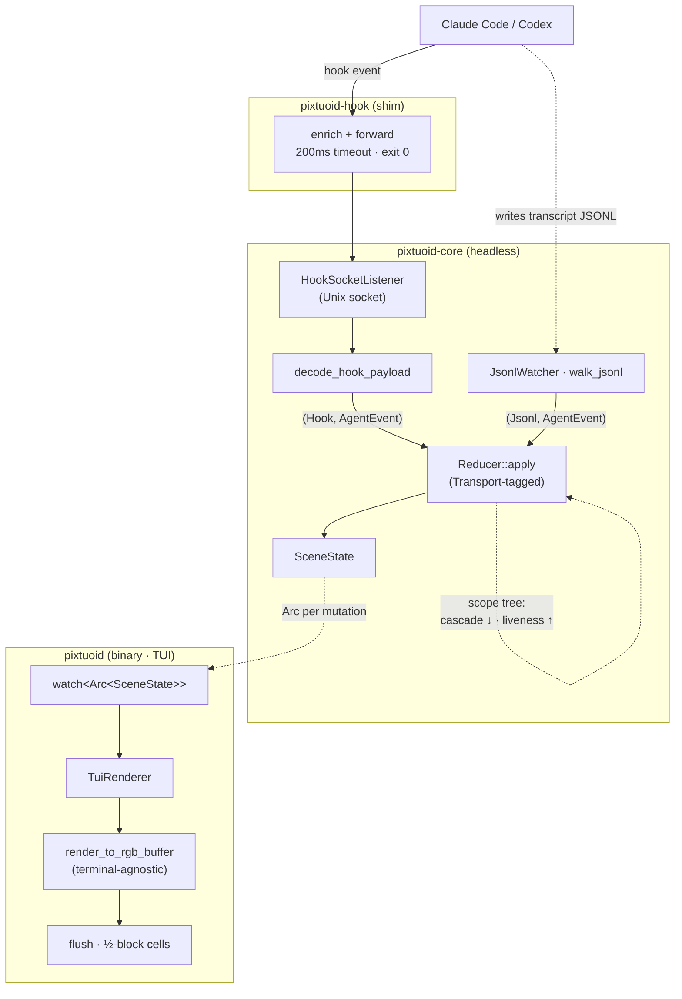

# Architecture

How a running coding-agent session becomes a moving sprite in the office.

> This file is the **single source** for pixtuoid's architecture overview. It
> renders on the website at [`/architecture`](https://ivanwng97.github.io/pixtuoid/architecture)
> and on GitHub (the diagram below is native Mermaid). `CLAUDE.md` (the agent
> guide) links here; per-crate "sharp edges" live in the nested `CLAUDE.md` files.

## The shape of it

pixtuoid is a Cargo workspace of **three crates** wired as a strict
**producer → reducer → renderer** pipeline:

- **`pixtuoid-core`** — the headless library. It has **no terminal dependencies**
  (no `ratatui`, no `crossterm`); everything terminal-specific sits behind the
  `Renderer` trait. Owns sources, the reducer + scene state, layout/physics/pose,
  and the sprite format.
- **`pixtuoid`** — the binary: `clap` CLI, `tokio` runtime wiring, and the TUI
  renderer (`ratatui` + `crossterm`).
- **`pixtuoid-hook`** — a tiny shim Claude Code invokes per hook event. It depends
  on neither other crate; it reads stdin JSON, forwards it over a Unix socket, and
  **always exits 0** so it can never block your agent.

Dependency direction is one-way: `pixtuoid → pixtuoid-core`. The `Renderer` trait
is the inversion point that keeps the core terminal-free (so the same pixel pass
can drive a PNG/GIF export, not just the terminal).

## Data flow

**Walking the pipeline (real symbols):**

1. **Ingest.** Claude Code fires a hook → the **`pixtuoid-hook`** shim
   (`enrich_payload` stamps `_pixtuoid_source`, a 200 ms write timeout, exit 0) →
   `HookSocketListener` on a Unix socket → **`decode_hook_payload`** turns the JSON
   into an `AgentEvent`. In parallel, **`JsonlWatcher` → `walk_jsonl`** tails each
   agent's transcript file (with a first-sight gate so historical/ended sessions
   don't resurrect) and decodes lines via a per-source decoder (`decode_cc_line` /
   `decode_codex_line`).
2. **One channel.** Every source multiplexes onto a single
   `mpsc::Sender<(Transport, AgentEvent)>` (buffer 256). The `Transport`
   (`Hook` | `Jsonl`) tag is load-bearing: the reducer uses it for **hook-wins
   dedup** so a hook and its transcript echo don't double-count.
3. **Reduce.** `reducer_task` drains the channel into **`Reducer::apply`**, which
   updates a `SceneState`, runs garbage-collection/stale sweeps on a 1 Hz tick,
   and delegates single-slot transitions to the FSM. After every change it
   publishes a fresh `Arc<SceneState>` on a `watch` channel.
4. **Render.** `TuiRenderer` borrows the latest scene (O(1), no lock) and paints
   it through **`render_to_rgb_buffer`** — a *terminal-agnostic* pixel pass — then
   `flush_buffer_to_term` compresses pairs of pixel rows into half-block (`▀`)
   terminal cells.

## Seams & invariants

These are load-bearing — see `CLAUDE.md` and the nested guides before changing them.

- **The `Source` trait is the only seam for adding an agent CLI** (Codex, Cursor,
  …). Per-source JSONL knowledge lives in that source's own decoder functions
  (injected into `JsonlWatcher` as fn pointers), not in a shared decoder.
- **Cross-source facts live in ONE registry row** (`source/registry.rs`,
  internal): each CLI's `SourceDescriptor` carries its label prefix, JSONL
  decoder, hook keying (`transcript_path` vs `session_id`, plus an optional
  source-specific hook decoder for events the shared arms can't express), and
  capability flags. The reducer derives lifecycle policy from those flags —
  e.g. the short idle reaper is `!has_exit_signal && resurrects_on_prompt`,
  which today holds only for Codex (no exit signal of any kind, but a swept
  session walks back in on the next prompt) — instead of matching CLI names.
- **Events flow through ONE tagged channel.** Producers tag their own events; the
  reducer never hardcodes `Transport::Hook` — it reads the producer's tag.
- **`pixtuoid-core` has no terminal dependencies.** Anything terminal-specific
  goes behind the `Renderer` trait.
- **The hook shim must never block the agent** — always exit 0, 200 ms write
  timeout.
- **Subagent supervision is a scope tree** (`state/scope.rs`): exit cascades
  *down* (a parent's `SessionEnd` reaps its subtree), liveness flows *up* (a
  working subagent keeps its ancestors fresh), and permission-blocked subagents
  are exempt from the stale sweep.
- **The walkable mask is the ground footprint only** — a top-down view, so a
  sprite can be visually taller/wider than the tile its base occupies.

## Where to go next

- **Configure it:** [`docs/CONFIGURATION.md`](CONFIGURATION.md) ·
  [live `/config`](https://ivanwng97.github.io/pixtuoid/config)
- **Contribute:** [`CONTRIBUTING.md`](CONTRIBUTING.md)
- **Agent/contributor detail:** the workspace `CLAUDE.md` + the nested per-crate
  `CLAUDE.md` files.
