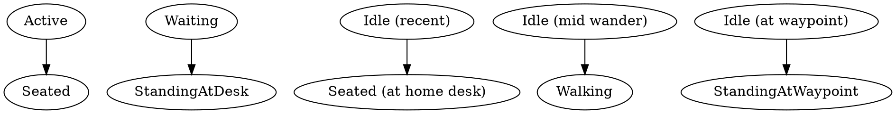

# Coworking-Lounge Scene Redesign

**Status:** approved (2026-05-21)
**Scope:** redesign the top-down office scene to feel like a real coworking
floor with mixed seated/standing/walking characters in an asymmetric layout.
**Supersedes:** the cubicle-grid `draw_scene` shipped in
[`2026-05-20-ascii-agents-design.md`](2026-05-20-ascii-agents-design.md) §6.

## Motivation

The current scene paints every agent in a fixed cubicle grid with one seated
pose. After running the visualizer against real CC sessions, the office reads
as static and uniform — agents look identical and the scene never changes
even when activity is happening. We want the office to feel **alive**:

- A glance should reveal what each agent is doing (working / waiting / idle)
  through pose changes, not just colored monitor glow.
- Idle agents should occasionally leave their desk and wander the floor, so
  the scene has motion even between tool calls.
- The space should look like an office room with distinct zones, not a grid
  of identical cells against a generic floor.

## Non-goals

- Multiple sprite packs / themes. One pack, hand-drawn in `.sprite` format.
- True per-agent personalization beyond the existing hair+shirt recolor.
- Conference call / meeting animations. (Future work.)
- Variable terminal-size adaptive layouts. The scene scales by hiding
  off-screen agents, not by re-zoning at runtime.

## Architecture overview

```
┌─── north wall (8 px) ────────────────────────────────────────┐
│                                                              │
│  ┌─ cubicle band ─────────────────────────────────────────┐  │  desk_y ≈ 12
│  │  D D D D D D D D D D                  ┌──────┐        │  │
│  │  c c c c c c c c c c                  │coffee│        │  │  seated chars
│  │                                       └──────┘        │  │
│  └────────────────────────────────────────────────────────┘  │
│                                                              │
│   ── walkway (open floor) ─────────────────────────────       │  walking path
│                                                              │
│  ┌─ lounge band ──────────────────────────────────────────┐  │
│  │                                                        │  │
│  │   ════════════                                         │  │  couch + decor
│  │   ║  couch   ║       🪴      🪴       waypoint         │  │
│  │   ════════════                                         │  │
│  │                                                        │  │
│  └────────────────────────────────────────────────────────┘  │
└─────────── south baseboard (3 px) ───────────────────────────┘
```

**Zones (top to bottom):**

| Zone        | Purpose                                                     |
| ----------- | ----------------------------------------------------------- |
| North wall  | Top frame; same as today.                                   |
| Cubicle band | Row of desks with one home slot per agent. Where Active and Waiting characters appear. |
| Walkway     | Open floor between cubicles and lounge. Where walking characters render. |
| Lounge band | Couch, coffee station, plants, named waypoints. Where wandering Idle chars terminate. |
| Baseboard   | South frame; same as today.                                 |

## Components

### 1. Sprites (`assets/sprites/default/`)

Replace the current character sprites; keep `desk.sprite`, `plant.sprite`,
`pack.toml` largely intact (palette grows by a couple of keys).

| File                | Size   | Used when                                                |
| ------------------- | ------ | -------------------------------------------------------- |
| `seated.sprite`     | 8 × 10 | Idle when at home desk (no monitor glow).                |
| `typing_0.sprite`   | 8 × 10 | Active animation, frame 0 (subtle motion of seated).     |
| `typing_1.sprite`   | 8 × 10 | Active animation, frame 1.                               |
| `standing.sprite`   | 6 × 12 | Waiting at desk OR standing at waypoint.                 |
| `walking_0.sprite`  | 6 × 12 | Walker, frame 0.                                         |
| `walking_1.sprite`  | 6 × 12 | Walker, frame 1 (legs swap).                             |
| `couch.sprite`      | 14 × 5 | Static decor in lounge band.                             |
| `coffee.sprite`     | 8 × 8  | Static decor near cubicle band edge.                     |

Animations declared in `pack.toml`:

```toml
[animations.seated]   frames = ["seated.sprite"]                       frame_ms = 600
[animations.typing]   frames = ["typing_0.sprite", "typing_1.sprite"] frame_ms = 140
[animations.standing] frames = ["standing.sprite"]                     frame_ms = 600
[animations.walking]  frames = ["walking_0.sprite", "walking_1.sprite"] frame_ms = 220
[animations.couch]    frames = ["couch.sprite"]                        frame_ms = 600
[animations.coffee]   frames = ["coffee.sprite"]                       frame_ms = 600
[animations.desk]     frames = ["desk.sprite"]                         frame_ms = 600
[animations.plant]    frames = ["plant.sprite"]                        frame_ms = 600
```

All sprites use the existing palette + 2 new keys: `C` (couch fabric), `K`
(coffee machine chrome).

**Anchor convention** (where the renderer paints each pose, given the agent's
home desk `(dx, dy)` at the desk's top-left corner):

| Pose                  | Anchor                                                  |
| --------------------- | ------------------------------------------------------- |
| SeatedIdle / SeatedTyping | `(dx + (DESK_W - 8) / 2, dy - 8)`  (sits on desk top)  |
| StandingAtDesk        | `(dx + (DESK_W - 6) / 2, dy - 12)` (stands beside desk) |
| StandingAtWaypoint{wp}| `WAYPOINTS[wp] - (3, 12)` (centered on waypoint x, feet at wp y) |
| Walking{from,to,t}    | `lerp(from, to, t) - (3, 12)`                           |

### 2. State → pose mapping (renderer-local)

The reducer's `ActivityState` enum is unchanged. Pose derives at render time
from `(state, wander_phase)`:

```rust
enum Pose {
    SeatedIdle,                              // seated.sprite (1 frame)
    SeatedTyping { frame: usize },           // typing_0/typing_1, cycle every 140ms
    StandingAtDesk,                          // standing.sprite at home desk anchor
    StandingAtWaypoint { wp: WaypointId },   // standing.sprite at lounge waypoint
    Walking {                                // interpolated lerp
        from: Point,
        to: Point,
        t: f32,                              // 0.0..1.0
        frame: usize,                        // walking_0/walking_1, swap every 220ms
    },
}
```

Mapping (Idle → choice between four sub-states):



### 3. Wander state machine

Per-agent wander cycle is **derived from `state_started_at` Instant** — no
new reducer state. The cycle has 4 phases that loop forever as long as the
agent stays Idle. Cycle starts the moment the agent enters Idle.

| Phase | Duration | Cumulative | Pose                          |
| ----- | -------- | ---------- | ----------------------------- |
| 0     | 3500 ms  | 0–3500     | SeatedIdle (at home desk)     |
| 1     | 1500 ms  | 3500–5000  | Walking (desk → waypoint)     |
| 2     | 2500 ms  | 5000–7500  | StandingAtWaypoint            |
| 3     | 1500 ms  | 7500–9000  | Walking (waypoint → desk)     |

Cycle length: `WANDER_CYCLE_MS = 9000`. Given `elapsed_ms = now -
state_started_at`, the renderer computes `phase_t = elapsed_ms %
WANDER_CYCLE_MS`, then matches against the cumulative column. The first
3500 ms after going idle is just sitting at the desk — gives the scene time
to settle before any motion starts.

Walker `t` value: `(phase_t - phase_start) / phase_duration`, clamped to 0..1.

Waypoint selection: deterministic and stable across restarts.
```rust
let wp_idx = (agent_id.raw() as usize) % WAYPOINTS.len();
```
`WAYPOINTS` is a fixed `&[Point]` declared in `layout.rs`: positions of
couch-left, couch-right, coffee-station, plant-1, plant-2 inside the lounge
band. Sized per `Layout::compute` based on lounge_band dimensions.

### 4. Renderer redesign (`tui/renderer.rs`)

Replace `cubicle_grid` with a zone-based layout:

```rust
struct Layout {
    buf_w: u16,
    buf_h: u16,
    cubicle_band: Rect,   // top zone (pixels)
    walkway: Rect,        // middle zone
    lounge_band: Rect,    // bottom zone
    home_desks: Vec<Point>,    // one per agent, in cubicle_band
    waypoints: Vec<Point>,     // 4 named points in lounge_band
}
```

New helpers:

- `layout::compute(buf_w, buf_h, num_agents)` — zone math + desk/waypoint placement.
- `pose::derive(slot, now, &layout)` — agent's `Pose` from `(state, state_started_at, now)`.
- `paint_lounge_decor(buf, &layout, &pack)` — couch, coffee, plants.
- `paint_character(buf, slot, pose, &pack)` — picks sprite + recolors + blits at the right position.

`draw_scene`'s outer structure stays the same: title, scene, footer.
Internals replace the desk + character passes with `layout` + per-agent
`pose` resolution + render.

### 5. Data flow

```
Reducer (unchanged)         draw_scene (each frame, ~30 fps)
─────────────────           ─────────────────────────────────
SceneState ──snapshot──►   Layout::compute(buf, agents.len())
                            │
                            ▼
                            for each AgentSlot:
                              pose = derive(slot, now, &layout)
                              paint_character(buf, slot, pose, pack)
                            paint_lounge_decor(buf, &layout, pack)
                            ▼
                            half-block flush to ratatui buffer
```

Position is computed every frame from `state_started_at` + AgentId — no
stored per-agent position. This keeps `AgentSlot` serializable for the
eventual daemon split (see CLAUDE.md sharp edges).

### 6. Visual reference (ASCII mock of cubicle + walker)

```
   ____                  Active agent at desk:
  /    \                   – seated.sprite over typing_0/1 cycle
  | () |                   – desk visible below
  |/--\|                   – monitor glow indicates state
  |    |               
  [====]                Walker mid-stride:
  ──────                  – walking_0/1 alternating every 220 ms
   ____                   – interpolated position between desk and waypoint
  /    \                  – no desk under them (open walkway)
  | () |
  /||\                  Waiting at desk:
  / \\                    – standing.sprite at desk row
                          – `?` speech bubble overlay (existing mechanism)
```

## Testing

- Unit tests: `pose::derive` returns the expected variant for each
  `(state, elapsed_ms)` combination, including all wander sub-phases. Pure
  function — no buffer or terminal needed.
- Unit tests: `layout::compute` places exactly N home desks for N agents,
  4 waypoints, and zones in increasing y-order with no overlaps.
- Integration: snapshot examples for each major pose combination
  (seated only, all-waiting, idle-walking-out, idle-at-waypoint, mixed),
  saved as `examples/snapshot.rs --scene <name>` PNGs for visual regression.
- Existing `tests/e2e.rs`, `tests/reducer.rs` unaffected (reducer unchanged).

## Risks & mitigations

| Risk                                                       | Mitigation                                                                       |
| ---------------------------------------------------------- | -------------------------------------------------------------------------------- |
| Walkers stutter when frame budget is tight                 | Position interpolation is a `f32` lerp; cost is ~negligible. Cap to 30 fps as today. |
| Pixel art at 8×10 / 6×12 loses readability                 | Iterate on art via snapshot tool. If unreadable, bump up to 10×12 (still smaller than current 12×14). |
| Path crossings look weird (two walkers overlap)            | Z-order by `slot.desk_index`; later walker paints on top. Acceptable for v1.    |
| Per-frame layout recompute is expensive at 30 fps          | Layout depends only on `(buf_w, buf_h, num_agents)`. Memoize via dirty bit if profiler flags it. Not needed for v1. |
| Waypoint placement collides with last cubicle when N large | Layout::compute reserves margin; if all-occupied, walker stays at desk instead of wandering. |

## Out of scope (deferred)

- Per-agent custom names visible above the character (today's label band is enough).
- Animated couch occupants / conversation pairs.
- Cycling between multiple shirts/hair styles for visual variety.
- Configurable terminal cell aspect (kept implicit in sprite size choice; see CLAUDE.md "Terminal cell aspect drives sprite design").

## File touch list

```
docs/superpowers/specs/2026-05-21-coworking-lounge-design.md  (this file)
docs/superpowers/plans/2026-05-21-coworking-lounge-v1.md      (next: writing-plans)
assets/sprites/default/pack.toml
assets/sprites/default/seated.sprite                  (new)
assets/sprites/default/typing_0.sprite                (rewrite, 8×10)
assets/sprites/default/typing_1.sprite                (rewrite, 8×10)
assets/sprites/default/typing_2.sprite                (delete; cycle is 2 frames)
assets/sprites/default/waiting.sprite                 (delete; standing.sprite takes over)
assets/sprites/default/standing.sprite                (new)
assets/sprites/default/walking_0.sprite               (new)
assets/sprites/default/walking_1.sprite               (new)
assets/sprites/default/idle.sprite                    (delete; seated.sprite covers it)
assets/sprites/default/couch.sprite                   (new)
assets/sprites/default/coffee.sprite                  (new)
crates/ascii-agents/src/tui/renderer.rs               (significant rewrite)
crates/ascii-agents/src/tui/embedded_pack.rs          (update include_str! list)
crates/ascii-agents-core/tests/sprite_format.rs       (update default_pack_loads_with_required_animations)
```
